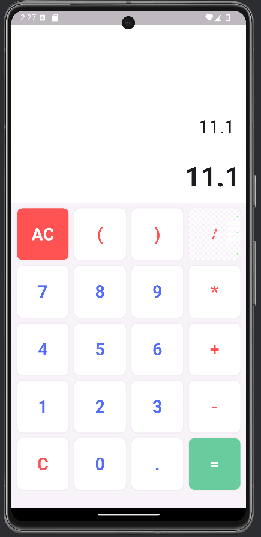

# Calculator Application in Flutter

This is a simple calculator application built using Flutter.

## Features

- Basic arithmetic operations (addition, subtraction, multiplication, division)
- Clear entry (CE) and all clear (AC) functions
- User-friendly interface

## Getting Started

These instructions will get you a copy of the project up and running on your local machine for development and testing purposes.

### Prerequisites

- Flutter SDK: [Install Flutter](https://flutter.dev/docs/get-started/install)
- A code editor (e.g., VSCode, IntelliJ, Android Studio)

## Screenshot

| Calculator Display     |
|------------------------|
| |

### Installation

1. Clone the repository:

    ```sh
    git clone https://github.com/Aaditya-Kumar-Mittal/calculator_app.git
    ```

2. Navigate to the project directory:

    ```sh
    cd calculator_app
    ```

3. Get the required dependencies:

    ```sh
    flutter pub get
    ```

4. Run the app:

    ```sh
    flutter run
    ```

## Usage

This application provides a simple calculator interface with the following functionalities:

- **AC:** Clears all input
- **C:** Deletes the last entered character
- **=:** Calculates the result of the entered expression

### Example Widget Code

```dart
import 'package:flutter/material.dart';
import 'package:math_expressions/math_expressions.dart';

class Calculator extends StatefulWidget {
  @override
  _CalculatorState createState() => _CalculatorState();
}

class _CalculatorState extends State<Calculator> {
  String userInput = "";
  String result = "0";

  @override
  Widget build(BuildContext context) {
    return Scaffold(
      appBar: AppBar(title: Text("Calculator")),
      body: Column(
        children: [
          Expanded(
            child: Container(
              alignment: Alignment.bottomRight,
              padding: EdgeInsets.all(24),
              child: Text(
                userInput,
                style: TextStyle(fontSize: 32, fontWeight: FontWeight.bold),
              ),
            ),
          ),
          Expanded(
            child: Container(
              alignment: Alignment.bottomRight,
              padding: EdgeInsets.all(24),
              child: Text(
                result,
                style: TextStyle(fontSize: 48, fontWeight: FontWeight.bold),
              ),
            ),
          ),
          Expanded(
            flex: 2,
            child: GridView.builder(
              gridDelegate: SliverGridDelegateWithFixedCrossAxisCount(
                crossAxisCount: 4,
                childAspectRatio: 1,
                crossAxisSpacing: 10,
                mainAxisSpacing: 10,
              ),
              itemBuilder: (context, index) {
                return _button(buttons[index]);
              },
              itemCount: buttons.length,
            ),
          ),
        ],
      ),
    );
  }

  List<String> buttons = [
    '7', '8', '9', '/', 
    '4', '5', '6', '*', 
    '1', '2', '3', '-', 
    'C', '0', '=', '+',
    'AC'
  ];

  Color getBGColor(String text) {
    if (text == 'AC' || text == 'C') {
      return Colors.redAccent;
    } else if (text == '=') {
      return Colors.blueAccent;
    } else {
      return Colors.white;
    }
  }

  Color getColor(String text) {
    if (text == 'AC' || text == 'C') {
      return Colors.white;
    } else if (text == '=') {
      return Colors.white;
    } else {
      return Colors.black;
    }
  }

  Widget _button(String text) {
    return InkWell(
      onTap: () {
        setState(() {
          handlePressedButton(text);
        });
      },
      child: Container(
        decoration: BoxDecoration(
          color: getBGColor(text),
          borderRadius: BorderRadius.circular(10),
          boxShadow: [
            BoxShadow(
              color: Colors.grey.withOpacity(0.1),
              blurRadius: 1,
              spreadRadius: 1,
            ),
          ],
        ),
        child: Center(
          child: Text(
            text,
            style: TextStyle(
              color: getColor(text),
              fontSize: 30,
              fontWeight: FontWeight.bold,
            ),
          ),
        ),
      ),
    );
  }

  void handlePressedButton(String text) {
    if (text == "AC") {
      userInput = "";
      result = "0";
      return;
    }

    if (text == "C") {
      if (userInput.isNotEmpty) {
        userInput = userInput.substring(0, userInput.length - 1);
        return;
      } else {
        return;
      }
    }

    if (text == "=") {
      result = calculate();
      userInput = result;

      if (userInput.endsWith(".0")) {
        userInput = userInput.replaceAll(".0", "");
      }
      if (result.endsWith(".0")) {
        result = result.replaceAll(".0", "");
      }
      return;
    }
    userInput = userInput + text;
  }

  String calculate() {
    try {
      var exp = Parser().parse(userInput);
      var evaluation = exp.evaluate(EvaluationType.REAL, ContextModel());
      return evaluation.toString();
    } catch (e) {
      return "Error";
    }
  }
}
```
